# Submission to the KTC 2023

For this submission, we developed a **postprocessing UNet** for EIT segmentation. The postprocessing network is trained on a dataset of synthetic phantoms and simulated measurements.

# Table of contents 
1. [Usage](#usage)
2. [Method](#method)
3. [Examples](#examples)
4. [Evaluation](#evaluation)
5. [Authors](#authors)

## Usage

We provide the `enviroment.yml` file to restore the conda enviroment used for the submission. You can create the environment using the following command:

```
conda env create -f environment.yml
```

The network weights are stored [here](https://seafile.zfn.uni-bremen.de/d/faaf3799e6e247198a23/) and have to be stored in *postprocessing_model*, such that the full path is *postprocessing_model/version_01/model.pt*. We precomputed the Jacobian for an empty water tank, as well as some other matrices (smoothness regulariser, node coordinates). This eliminates the need to install FEniCS in the environment. All of these matrices are available [here](https://seafile.zfn.uni-bremen.de/d/9108bc95b2e84cd285f8/) and have to be stored in *data/*. The script `main.py` can be used to reconstruct phantoms: 

```
python main.py /path_to_input_folder /path_to_ouput_folder difficulty_level
```


### Enviroment


## Method

Our goal is to train a postprocessing UNet, 

$$ f_\theta(\mathcal{R}(U)) \approx \sigma_\text{segmentation} $$

to predict the segmentation of the conductivity $\sigma$ based on some initial reconstruction $\mathcal{R}(U)$. We directly represent this segmentation map on a $256 \times 256$ pixel grid. Further, the initial reconstruction is also  interpolated to the $256 \times 256$ pixel grid. This has the practical advantage that we can implement the model as a convolutional neural network and the method is independent of the underlying mesh.

Note that the backbone of our approach used exactly the same network architecture as in our other repository.

### Initial Reconstructions

We use linearised time-difference reconstructions for the conditional input. Computing this linearised time-difference reconstruction amounts to solving a regularised least squares problem

$$ \Delta \sigma = (J_{\sigma_0} \Gamma_e^{-1} J_{\sigma_0} + \alpha_1 R_\text{SM} + \alpha_2 R_\text{Laplace} + \alpha_3 R_\text{NOSER})^{-1} J_{\sigma_0}^T \Gamma_e^{-1} \Delta U, $$

where $J_{\sigma_0}$ is the Jacobian w.r.t. to a constant background conductivity, $\Gamma_e^{-1}$ is the noise precision matrix and $\Delta U = U^\delta - F(\sigma_0)$ is the difference of the measurements. For $F(\sigma_0)$ we make use of the provided measurements of the empty water tank. 

We use a combination of three different priors, where $R_\text{SM}$ denotes a [smoothness prior](https://www.fips.fi/KTC2023_Instructions_v3_Oct12.pdf), $R_\text{Laplace}= - \bigtriangleup$ the graph laplacian and $R_\text{NOSER} = diag(J_{\sigma_0} \Gamma_e^{-1} J)$ the [NOSER](https://pubmed.ncbi.nlm.nih.gov/36909677/) prior. 

In total, we use five different combinations of $\alpha_1, \alpha_2$ and $\alpha_3$ as each regularisation results in different artifacts in the reconstruction. This means, that our conditional input, interpolated to the pixel grid, is of the size $5 \times 256 \times 256$. 


### Training

To deal with the different difficulty levels of the challenge, we added the level $l$ as an additional input to the model, i.e.

$$ f_\theta(\mathcal{R}(U), l) \approx \sigma_\text{segmentation}. $$

Additionally, for each level we used different hyperparameters $\alpha_l$ for the initial reconstruction. These hyperparameters were found with a random search w.r.t. to the four phantoms provided by the organisers.  


### Synthetic Training Data

For simulation, we used the forward operator provided by the organisers with the dense mesh. For the reconstruction process, we used a customized mesh. Further, we implemented the complete electrode model in FEniCS. This allows us to directly compute the Jacobian for the linearised reconstruction with FEniCS. Here, we use continuous piece-wise linear functions for the potential and piece-wise constant functions for the reconstruction of the conductivity. We create synthetic conductivity images to train the conditional diffusion model. For this, we simulate a random number (1 to 4) of objects inside the water tank. In this context, we use circles, random polygons, and hand-drawn objects. We ensure that these elements do not intersect or overlap. Each object is then randomly assigned to be either conductive or resistive. Using this method, we create ~15.000 images per challenge level.

## Examples
### Level 1

<p float="left">
  
  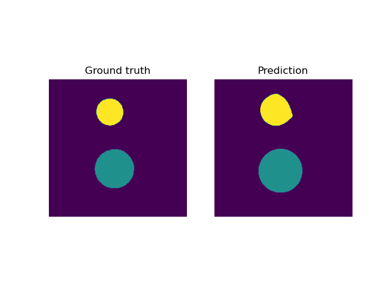
</p>

<p float="left">
  
  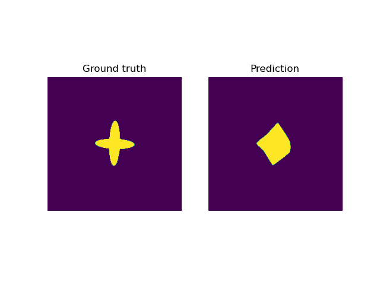
</p>

### Level 2

<p float="left">
  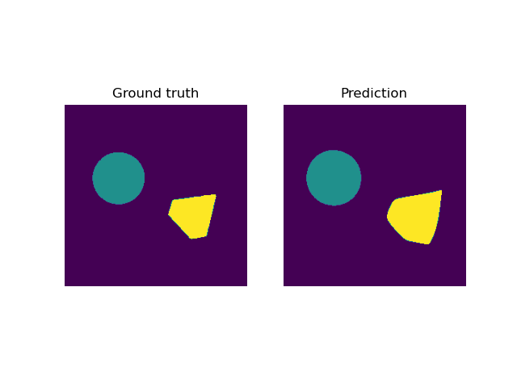
  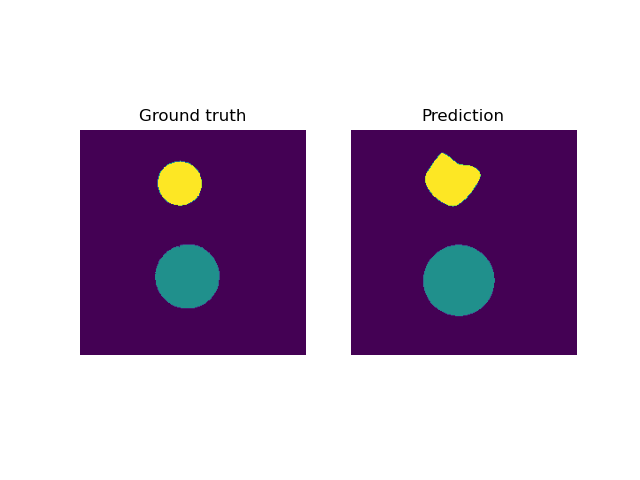
</p>

<p float="left">
  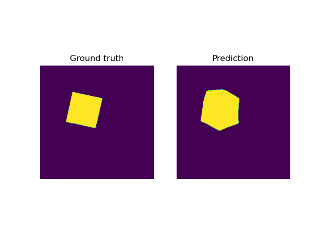
  
</p>


### Level 3

<p float="left">
  
  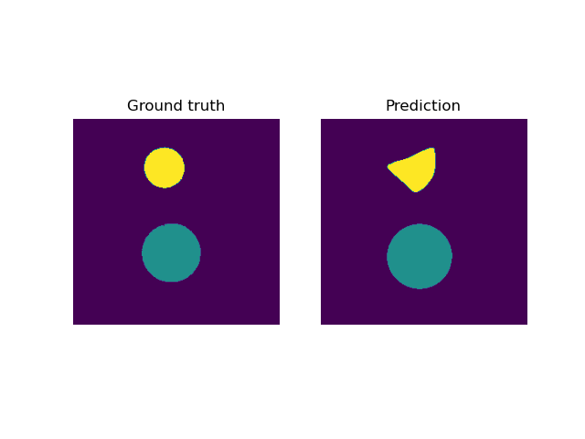
</p>

<p float="left">
  
  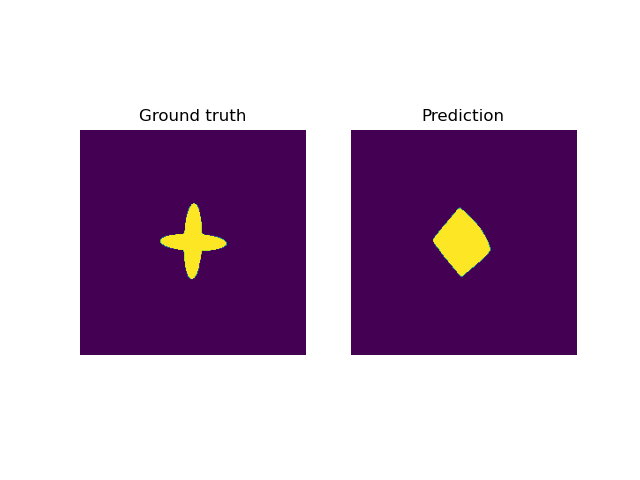
</p>

### Level 4

<p float="left">
  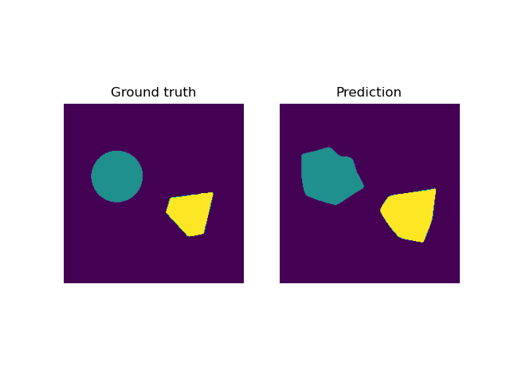
  
</p>

<p float="left">
  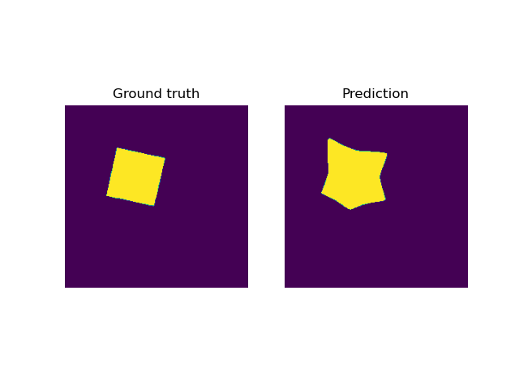
  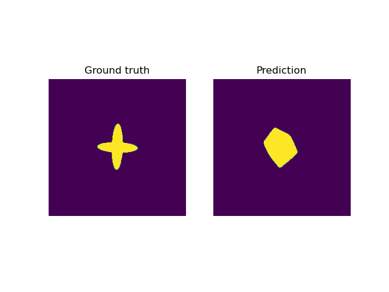
</p>

### Level 5

<p float="left">
  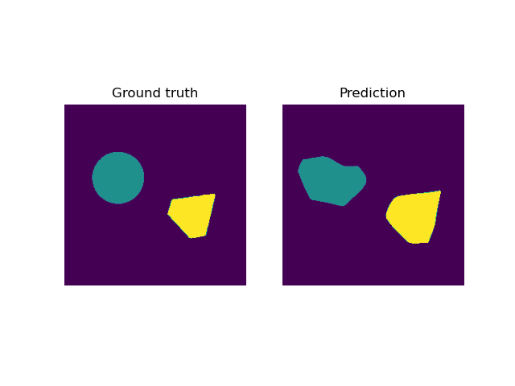
  
</p>

<p float="left">
  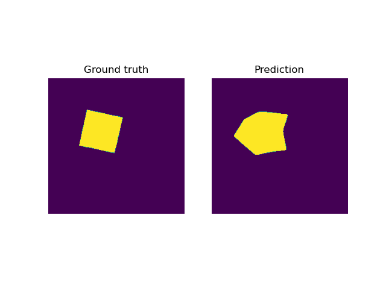
  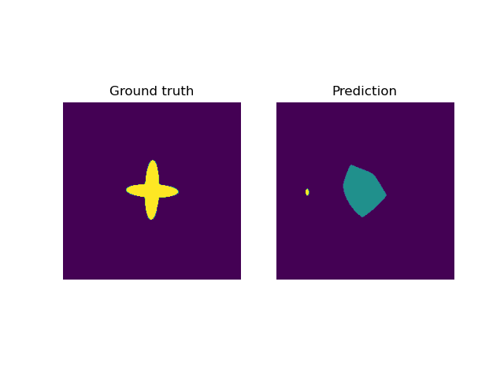
</p>

### Level 6

<p float="left">
  
  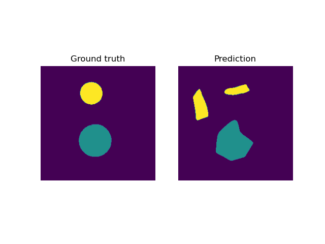
</p>

<p float="left">
  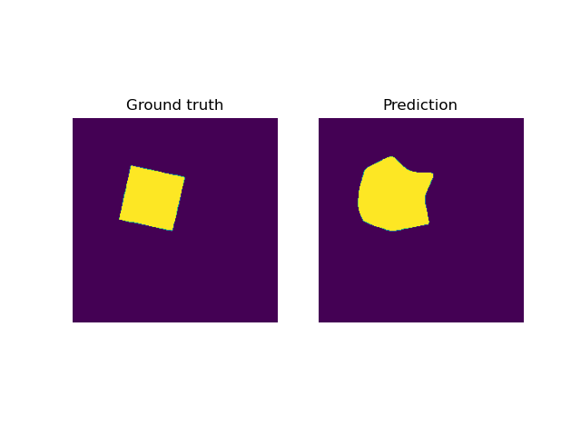
  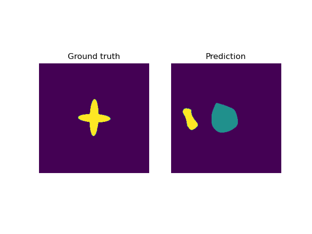
</p>

### Level 7

<p float="left">
  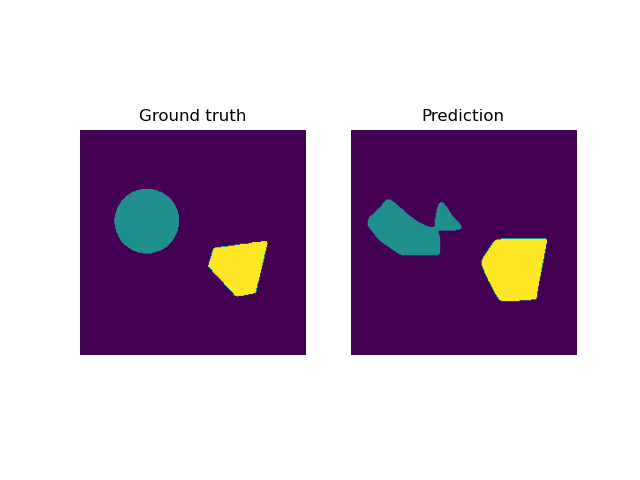
  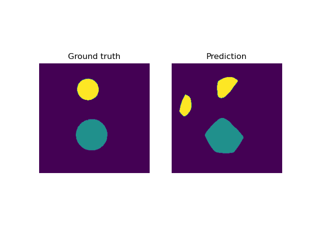
</p>

<p float="left">
  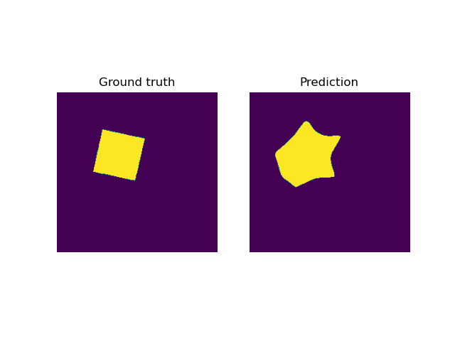
  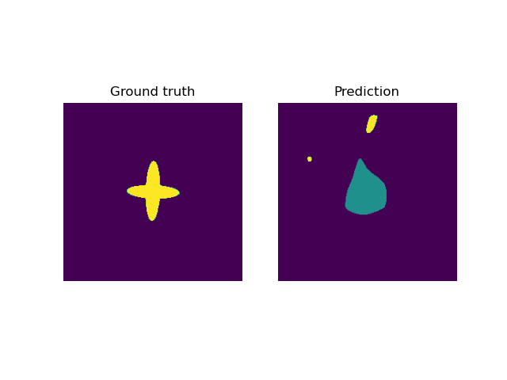
</p>

## Evaluation

We evaluate the postprocessing UNet w.r.t. the [score function](https://www.fips.fi/KTC2023_Instructions_v3_Oct12.pdf) used in the challenge. In the following we present the mean score over the four challenge phantoms:


| Level         |    Score       |
|---------------|----------------|
| 1            | $0.873$       |
| 2            | $0.881$       |
| 3            | $0.866$       |
| 4            | $0.838$       |
| 5            | $0.791$       |
| 6            | $0.643$       |
| 7            | $0.681$       |


## Authors

- Alexander Denker<sup>1</sup>, Tom Freudenberg<sup>1</sup>, Željko Kereta<sup>2</sup>, Imraj RD Singh<sup>2</sup>, Tobias Kluth<sup>1</sup>, Peter Maass<sup>1</sup>, Simon Arridge <sup>2</sup>

<sup>1</sup>Center of Industrial Mathematics (ZeTeM), University of Bremen, Bibliothekstr. 5, 28359 Bremen, Germany.

<sup>2</sup>Department of Computer Science, University College London, 66-72 Gower St, WC1E 6EA, London, United Kingdom.
